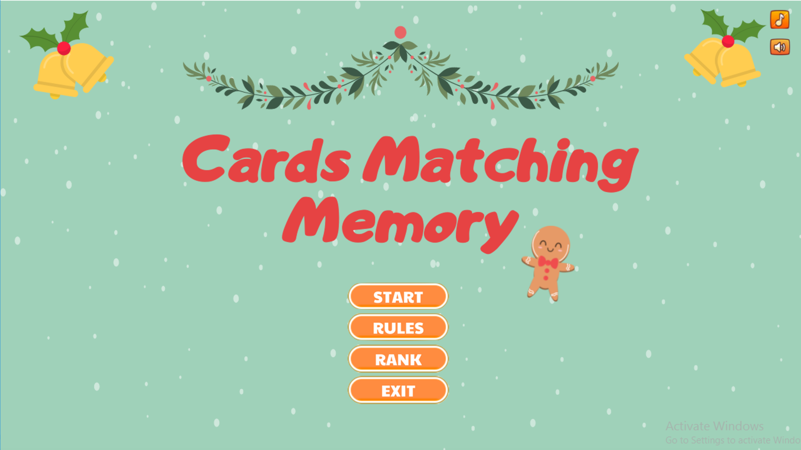

# Cards Matching Memory
_Trương Thị Huyền Trâm - 21020413_
--------------------------

Project này mình làm về game Cards Matching Memory. Ngôn ngữ được sử dụng trong game là [C++](https://vi.wikipedia.org/wiki/C%2B%2B) và thư viện đồ họa [SDL2](https://www.libsdl.org/).
### Mục lục:
- [1. Hướng dẫn cài đặt](https://github.com/Hakuryo0413/Card-Memory#1-h%C6%B0%E1%BB%9Bng-d%E1%BA%ABn-c%C3%A0i-%C4%91%E1%BA%B7t)
- [2. Mô tả chung](https://github.com/Hakuryo0413/Card-Memory#2-m%C3%B4-t%E1%BA%A3-chung)
- [3. Các chức năng](https://github.com/Hakuryo0413/Card-Memory#3-c%C3%A1c-ch%E1%BB%A9c-n%C4%83ng)
- [4. Các kĩ thuật sử dụng](https://github.com/Hakuryo0413/Card-Memory#4-c%C3%A1c-k%C4%A9-thu%E1%BA%ADt-s%E1%BB%AD-d%E1%BB%A5ng)
- [5. Nguồn tham khảo](https://github.com/Hakuryo0413/Card-Memory#5ngu%E1%BB%93n-tham-kh%E1%BA%A3o)
- [6. Kết luận](https://github.com/Hakuryo0413/Card-Memory#6-k%E1%BA%BFt-lu%E1%BA%ADn)
### 1. Hướng dẫn cài đặt:
 
- Bước 1: Cài đặt `SDL2` vào `Visual Studio Code` theo như [Hướng dẫn](https://www.youtube.com/watch?v=Zdg6aaBTctw&t=449s).
- Bước 2: Tải project game về và mở `Visual Studio Code`.
- Bước 3: Mở `terminal` gõ lệnh `mingw32-make` và `./Cards_Matching_Memory.exe` để chơi game.
 
### 2. Mô tả chung:

Cards Matching Memory Game là một trò chơi trí nhớ vui nhộn giúp phát triển các kỹ năng ghi nhớ tuyệt vời. Game có cách chơi đơn giản. Lật 2 thẻ bài bằng cách nhấp chuột vào chúng. Nếu chúng giống nhau, cặp bài sẽ tự động biến mất. Nếu không khớp, chúng sẽ lật lại để người chơi thử lại. Trò chơi sẽ kết thúc khi tất cả các thẻ bài biến mất

### 3. Các chức năng:
> Video minh họa: 
> [Cards Matching Memory](https://youtu.be/ckTjlkXhW1E)
- Chọn độ khó: Độ khó khác nhau thì số lượng thẻ bài sẽ khác nhau. 
- Chức năng tắt nhạc: Khi nhấn vào sẽ dừng phát nhạc nền
- Chức năng tắt hiệu ứng âm thanh: Khi nhấn vào sẽ tắt các âm thanh nhấn nút, click, chọn đúng cặp thẻ bài ...
- Chức năng xem `Rank` của cả 3 `level` để người chơi phá kỉ lục.
- Chức năng xem `Hướng dẫn chơi` 
### 4. Các kĩ thuật sử dụng:
- Thư viện đồ họa `SDL2`: Sử dụng hiển thị ảnh, chữ, phát âm thanh, màu sắc sử dụng (SDL_MapRGB). 
- Mảng 2 chiều: dùng để lưu trữ trạng thái hiển thị của các thẻ.
- Đọc, in dữ liệu ra file: dùng để lưu trữ dữ liệu thành tích, tránh bị mất mỗi lần chạy game và lưu trữ.
- Random để chọn ngẫu nhiên các cặp thẻ bài trong kho thẻ ban đầu.
- Cấu trúc, lớp: Xây dựng một số cấu trúc để lưu tọa độ (`x` và `y`), cấu trúc thẻ bài (bao gồm loại thẻ, chiều dài, chiều rộng , chế độ ẩn,...).
- Chia code thành các folder: `General` (xử lý khởi tạo, đóng SDL, xử lí chuyển đổi màn hình), `GUI` (xử lý việc hiển thị các nút, thay đổi trạng thái nút)), `Screens` (xử lý việc hiển thị ảnh và text), `Game` (chứa việc xử lý các sự kiện cũng như logic game),`Media` (chứa các font, graphics, music ).
- `Photoshop`: Cắt ghép ảnh, chỉnh sửa các ảnh trên mạng theo ý thích để đưa vào game.
### 5.Nguồn tham khảo:
- [Cách chia file](https://github.com/TycheBooker/Memory-CPP)
- [Tile](https://www.canva.com/design/DAFBKUDh83Y/uGGmdZePS6EaX75g4i4_PA/view?utm_content=DAFBKUDh83Y&utm_campaign=designshare&utm_medium=link2&utm_source=sharebutton).
- [Sound](https://www.zapsplat.com/).
- [Music](https://www.fesliyanstudios.com/)
- [Button](https://wenrexa.itch.io/uimobile-free)
### 6. Kết luận:
- Sau khi hoàn thành dự án game cuối kì trong học phần này, em học và tìm hiểu được nhiều kiến thức và kinh nghiệm về [SDL2](https://lazyfoo.net/tutorials/SDL/).
tư duy Code, thuật toán, kĩ năng chỉnh sửa ảnh.
- Cách sử dụng thêm nhiều chức năng của `Github`
 

**- Các hướng phát triển trong tương lai:**
 
- Nâng cao kỹ năng photoshop để có đồ họa đẹp hơn cho game.
- Thêm các theme để người chơi có nhiều lựa chọn hơn. 
- Thêm các animation tạo hiệu ứng khi lật bài, biến mất.
- Thêm chế độ nhiều người chơi.
 
***Mọi thắc mắc gửi về email: `21020413@vnu.edu.vn`***
